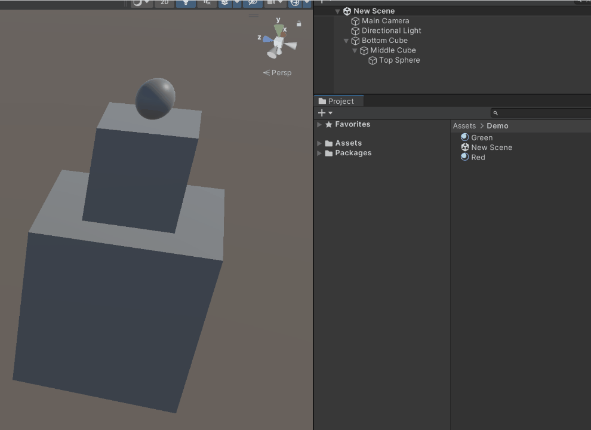

# unity-apply-material-all


[](https://github.com/semantic-release/semantic-release)
[](https://openupm.com/packages/at.ac.fhstp.apply-material-all/)

A Unity editor utility for applying a material to all GameObjects in a hierarchy

## Usage

Hold `Alt` while dragging a material onto a game object to apply the material to the game object as well as all its children. This will replace all `MeshRenderer`s primary material.



## Installation

Install via openupm using 
```sh
openupm add at.ac.fhstp.apply-material-all
```